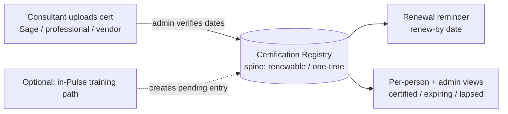

# Pulse Onboarding & Certification System

> Brainstorm follow-on from `docs/ideation/2026-06-13-pulse-onboarding-certification-ideation.md`. Scope: Deep. Subject is the Pulse portal (Next.js 14 + Supabase + Resend).
> Revised 2026-06-14 after a 7-persona document review: v1 thinned to a registry + single renewal reminder (Phase A); escalation ladder, enable-email fan-out, and extra dashboards moved to Phase A.2; security/privacy, upload-safety, and import-safety requirements added.

## Problem Frame

Jera (a Sage Intacct/X3 consultancy) is hiring rapidly and has two linked, currently-unmet needs:

1. **Get new hires to billable, fast and consistently** — a structured journey to "certified & billable" where the right people are prompted to enable each hire.
2. **Never lose a certification again** — one home for every consultant's externally-issued credentials, with validity dates and automatic renewal reminders, protecting both delivery quality and Sage partner-tier standing.

Today these live in fragments: Pulse has a phased onboarding workflow (28 tasks, role-filtered — `frontend/lib/mock/onboarding.ts`), a policy gate, 5 onboarding forms, and a Sage-University billable-readiness tracker (`frontend/app/training/page.tsx`, `frontend/lib/mock/training.ts`). But certifications are modeled only as three booleans (`supervised` / `ilt` / `certified` in `frontend/types/database.ts`) with **no expiry, renew-by, or evidence fields**, there is **no central registry across all consultants**, and **no scheduled renewal notifications**. Renewal chasing currently falls on the owner manually.

**Central design decision:** treat the **certification registry as the spine**. Each registry entry carries a **lifecycle kind — `renewable` or `one-time`** — so external certs (renewable) and onboarding/training milestones (mostly one-time) can share one timeline without the renewal/status engine misfiring on entries that never expire. Only `renewable` entries enter the reminder sweep.

## Phasing Overview

- **Phase A (v1)** — the registry + a single renewal reminder, built real (engine) with mock-first UI. This is the first usable version.
- **Phase A.2 (fast-follow)** — full reminder ladder + escalation chain, onboarding enable-email fan-out, per-hire blocker view, firm-wide + per-person dashboards, CPD-hour logging, capability/billable-ready ladder.
- **Phase B (later, integration-gated)** — staffing gate, partner-tier cockpit, Teams nudges, Open-Badge import, proposal/audit-pack generator, graded billing ladder.

## Requirements — Phase A (v1)

**Certification Registry (the spine)**
- R1. The registry stores credentials for three families: **Sage product certs** (Intacct, X3), **professional qualifications** (CA(SA), ACCA, CIMA, etc.), and **other vendor/tech certs** (Microsoft, AWS, security). Internal-only Jera competencies are out of scope.
- R2. Each credential record captures: holder, family, **lifecycle kind (`renewable` | `one-time`)**, credential name, issuing body, issued date, expiry date, and a separate **renew-by** date (renewal action must start; precedes expiry). Where a credential has no expiry, it is marked non-expiring. Only `renewable` entries are eligible for reminders (R7).
- R3. Each credential holds an uploaded **proof file** (PDF/image). Provenance (who, when) and every subsequent change are recorded in an **append-only audit log** (edits write a new row, never overwrite) so the record is genuinely tamper-evident and audit-ready.
- R4. Credentials carry a status derived from dates: `pending verification`, `active`, `expiring soon`, `expired`. Status is computed, not hand-set.
- R5. **Upload is the primary path and is independent of training.** A consultant who already holds a credential (prior employer, earlier in the year, self-study) uploads it directly — completing the in-Pulse training is **not** a prerequisite to being certified in the registry. An **admin verifies every upload**, and the verification step specifically includes **confirming the validity dates (issued / expiry / renew-by) are correct** before the credential becomes `active`. Unverified uploads sit in `pending verification`.
- R6. The data model is designed so that **CPD/CPE hour logging** (Phase A.2) can be added later without restructuring existing records.

**Renewal Reminder (single, in v1)**
- R7. A scheduled process re-computes credential status daily for `renewable` entries and identifies those reaching their **renew-by** date.
- R8. In v1, a **single renewal reminder** is sent by email (Resend, `frontend/lib/resend.ts`) at the renew-by point to the credential holder (with the admin/owner visible as tracker). The full 90/60/30/14/day-of ladder and the holder→manager→owner escalation chain are **Phase A.2** (see below).

**Onboarding → Registry Connection (minimal in v1)**
- R11. Completing the in-Pulse Sage training path creates a registry entry in `pending verification` (admin then confirms dates per R5). This is one optional route to a credential — it does not bypass admin verification, and it is not required for upload.

**Security & Privacy** *(added from review)*
- R18. **Access control:** the firm-wide/all-consultant credential view is admin/manager-only; a consultant can see only their own credentials. Per-person views enforce ownership (no enumerating peers' records).
- R19. **Private storage:** certificate files live in a **private bucket with signed-URL access** (never public-by-default); database row-level-security policies cover the new certification tables.
- R20. **Upload validation:** accept only PDF/JPG/PNG within a defined size cap; reject anything else with a clear error.
- R21. **Data minimisation & retention:** reminder emails carry minimal PII (no licence numbers in the body); define a retention/deletion rule for leavers consistent with **POPIA**.

**Import safety** *(added from review)*
- R22. **Import baseline:** when bulk-loading existing credentials, record which reminder points are already past and do **not** send them retroactively — only fire reminders for points crossed after the import date. Support a dry-run that reports intended sends before dispatching.
- R23. **Date fallback:** if `renew-by` is missing on an imported credential, derive it from expiry (e.g. expiry minus a default lead) so a still-valid credential never silently goes un-reminded; never show a credential `expired` purely because `renew-by` passed while it is still valid by expiry.

**Build approach (cross-cutting)**
- R16. **Hybrid build**: screens are built mock-first (consistent with Pulse's frontend-first phase), but the **registry + renewal engine are genuinely real** (persisted data, real file upload, real scheduled reminder). "Engine real" explicitly includes the temporal sweep behavior (repeated runs, idempotency), not just one-pass status computation.
- R17. Real persistence and storage use the existing Supabase backend; the mock accessor seam (`frontend/lib/mock/index.ts`) is the swap point so screens migrate from mock to real data without rewrites.

### Phase A build prerequisites (verify before building) *(added from review)*
- P1. **Scheduled-job mechanism** for the daily sweep must be confirmed (cron / Supabase `pg_cron` / edge function) before Phase A build — none exists in the stack today.
- P2. **Privileged DB access**: the daily sweep and admin-verify writes require a **service-role Supabase client** (not present today — the app ships only anon-key clients) plus matching RLS policies for the new cert tables. The current anon-key client cannot perform these writes.

## Requirements — Phase A.2 (fast-follow)
- Full reminder **ladder** (90/60/30/14/day-of) and **escalation chain** (holder → manager → owner), including the definitions deferred below: who "manager" is per consultant, and which ladder point triggers each escalation tier; escalation stops once the holder acts.
- **Onboarding enable-email fan-out** (R12): on hire confirm, prompt role-based owners by email; define the task→owner mapping (reuse `onboarding_tasks.default_owner` or a role model).
- **Per-hire live-blocker view** (R13): surface the current blocking owner/task for hire + manager.
- **Firm-wide dashboard** (R14, color-coded, expiring first) and **per-person timeline** (R15).
- **CPD-hour logging** against annual targets (model already accommodates per R6).
- **Capability / billable-ready ladder**: define what "billable-ready" means (combination of completed onboarding + credential statuses) and surface it.

## Success Criteria (Phase A)
- A consultant's full credential set (across all three families) is visible in one place with correct, date-derived status.
- No certificate lapses silently: every `renewable` credential approaching its renew-by date triggers a reminder automatically, and the owner is no longer the manual chaser.
- An uploaded credential is only `active` after an admin has confirmed its validity dates.
- Importing the existing credential set produces a clean go-live (no retroactive reminder blast) and no still-valid credential is left un-reminded.
- Certificate files are not publicly accessible; only the holder and admins/managers can view a given credential.

## Scope Boundaries (v1 non-goals)
- **No reminder ladder / escalation chain** in v1 — single reminder only (ladder + escalation are Phase A.2).
- **No onboarding enable-email fan-out, per-hire blocker view, or firm-wide/per-person dashboards** in v1 — Phase A.2.
- **No CPD-hour logging** in v1 (model accommodates it; Phase A.2).
- **No staffing/deployable gate** (needs a Zoho Projects integration that does not exist), **no partner-tier cockpit** (needs Sage tier rules), **no Teams nudges** (Teams not integrated), **no Open-Badge/Credly auto-import**, **no proposal/audit-pack generator**, **no graded billing-rate ladder** — all Phase B.

## Phase B (Roadmap, integration-gated)
Each is gated by an integration or policy input to confirm first: **deployable-state staffing gate** (Zoho Projects API), **partner-tier certified-headcount cockpit** (Sage per-product rules), **Teams in-channel nudges** (Microsoft Graph), **Open-Badge verify-and-import** (issuer badge support), **commercial-asset generator** (proposal appendix + audit pack), **graded capability/billing ladder**.

## Key Decisions
- **Registry-as-spine with a lifecycle kind** (`renewable` / `one-time`): one source of truth without forcing onboarding steps to behave like expiring certs.
- **Upload is independent of training; admin verifies dates on every upload**: a held credential counts once an admin confirms it — training is one optional route, not a gate.
- **Both pains as one connected system, but phased**: registry + single reminder first (Phase A); automation/dashboards as fast-follow (A.2); integrations later (B).
- **Dates-now, CPD-later**; **hybrid real/mock build** (engine real incl. temporal behavior); **email-first notifications**.
- **Security/privacy and import-safety stated as v1 requirements**, not deferred, because the registry stores PII + files from day one.

## Dependencies / Assumptions
- **Verified:** Email sending exists (`frontend/lib/resend.ts`) but has no cert-reminder template/recipient logic yet; cert data is currently milestone-flags only with no expiry fields (`frontend/types/database.ts`); the app ships only anon-key Supabase clients; Zoho is referenced in content but not API-integrated; no Teams integration; deployment is self-hosted (`pm2.config.js`, `nginx.conf`) with no scheduler.
- **Prerequisite (verify before Phase A — see P1/P2):** scheduled-job mechanism and a service-role client + RLS for the cert tables.
- **Assumption (verify in planning):** Supabase is provisioned and usable for real persistence + private file storage in this environment.

## Outstanding Questions

### Resolve Before Planning
- (none — the verification model and v1 scope were resolved in the 2026-06-14 review.)

### Deferred to Planning
- [Affects P1][Technical][Needs research] Which scheduled-job mechanism runs the daily sweep, and how are reminder sends made idempotent (no double-sends on re-runs)?
- [Affects P2/R18/R19][Technical] Service-role client setup and the exact RLS / storage-bucket policies for the new cert tables and proof bucket.
- [Affects R3/R20][Technical] Proof-file storage location, size cap, accepted MIME types, and retention period.
- [Affects R4/R8][Design] The "expiring soon" window (day count) and the single-reminder timing relative to renew-by.
- [Affects R1/R2][Needs research] Real renewal cadence for Sage Intacct/X3 partner certs (maintenance/gap exams), to set realistic renew-by defaults.
- [Affects R21][Needs research] Whether Resend is an acceptable processor for any PII in reminder emails under POPIA.
- [Affects A.2 R12][Technical] Onboarding task → role-owner mapping (reuse `onboarding_tasks.default_owner`?) and how "manager" per consultant is derived for escalation.
- [Affects Design] UX specs to define during planning/design: upload in-progress/confirmation/error states, the admin verification-queue interaction (incl. reject + reason), color-coding semantics + accessibility (not color alone), navigation between registry/per-person views, empty states, and filter/search to answer "who is certified in X".
- [Affects R3][Technical] Secrets management for the scheduled job's Supabase service key + Resend API key on the self-hosted box.

## Next Steps
-> `/ce-plan` for the Phase A (registry + single renewal reminder) implementation plan.
