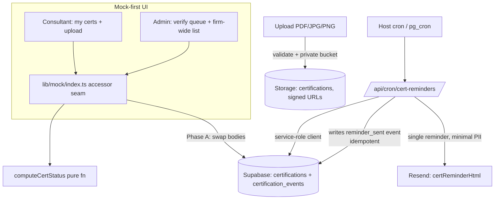

# feat: Certification Registry + Renewal Reminder (Phase A)

**Target repo:** `pulse` (`~/Documents/GitHub/pulse`). All paths below are relative to that repo root.

## Overview

Phase A delivers the **certification registry** (one home for every consultant's externally-issued credentials, with validity dates and audit-ready proof files) plus a **single automatic renewal reminder**. Built "hybrid": screens are built mock-first against the existing accessor seam, but the registry persistence, file storage, status engine, and the reminder sweep are **real**. Phase A.2 (full reminder ladder + escalation, onboarding enable-email fan-out, dashboards) and Phase B (Zoho staffing gate, partner-tier cockpit, Teams, Open-Badge import) are explicitly out of scope here.

## Problem Frame

Jera is hiring rapidly and has no central place that tracks consultants' certifications or their expiry, so renewal chasing falls on the owner manually and certs can lapse silently — a delivery-quality and Sage partner-tier risk. Today certifications exist only as three booleans on `TrainingEnrolment` (`getting_started_done` / `ilt_done` / `certified`) with no dates, no proof, no registry, and no notifications (see origin: `docs/brainstorms/2026-06-13-pulse-onboarding-certification-requirements.md`).

## Requirements Trace

- R1. Registry stores three credential families: Sage, professional, vendor.
- R2. Each record: holder, family, **lifecycle kind (renewable/one-time)**, name, issuer, issued/expiry/**renew-by** dates, non-expiring flag; only renewable entries are reminder-eligible.
- R3. Uploaded proof file with an **append-only audit log** (tamper-evident provenance).
- R4. Status computed from dates: pending verification / active / expiring soon / expired.
- R5. Upload is independent of training; **admin verifies every upload incl. validity dates** before active.
- R6. Model is CPD-ready (CPD logging itself is Phase A.2).
- R7. Daily sweep recomputes status for renewable entries.
- R8. **Single** renewal reminder by email at renew-by (full ladder/escalation = A.2).
- R11. In-Pulse training completion creates a pending-verification entry (optional path).
- R16/R17. Hybrid build; real persistence via Supabase; mock accessor seam (`frontend/lib/mock/index.ts`) is the swap point.
- R18. Access control: firm-wide view admin-only; consultants see only their own certs.
- R19. Private storage bucket + signed URLs + RLS on cert tables.
- R20. Upload validation: PDF/JPG/PNG + size cap.
- R21. POPIA retention/deletion; minimal-PII emails.
- R22. Import baseline (no retroactive reminder storm on bulk load).
- R23. Renew-by fallback from expiry; never show still-valid certs as expired.

## Scope Boundaries

- Single reminder only — **no** ladder (90/60/30/14) and **no** holder→manager→owner escalation.
- **No** onboarding enable-email fan-out, per-hire blocker view, or firm-wide/per-person dashboards beyond the basic registry list + verify queue needed for R18.
- **No** CPD-hour logging (model accommodates it only).

### Deferred to Separate Tasks
- Reminder ladder + escalation chain, enable-email fan-out, dashboards: **Phase A.2** (origin doc).
- Zoho staffing gate, partner-tier cockpit, Teams nudges, Open-Badge import, proposal/audit-pack, billing ladder: **Phase B** (origin doc).

## Context & Research

### Relevant Code and Patterns
- **Mock seam:** `frontend/lib/mock/index.ts` — single accessor module screens import from; per-entity seeds; centralized mutators; `__resetMockState()` for tests. New registry accessors/mutators go here.
- **Existing training model:** `frontend/lib/mock/training.ts`, `frontend/types/database.ts` (`TrainingEnrolment`, `IltSession`, `BillableSummaryRow`), screen `frontend/app/training/page.tsx` — two-tier (employee/admin) pattern to mirror for the registry UI.
- **Schema conventions:** `database/pulse_v5_schema.sql` — UUID PKs, `created_at`/`updated_at TIMESTAMPTZ DEFAULT NOW()`, RLS via `is_admin()` (`employees.role='admin'` keyed on `auth.uid()`) and `employee_id = auth.uid() OR is_admin()` ownership policies.
- **Storage:** schema §21 documents buckets created manually in the Supabase dashboard (`documents`, `receipts`, `contracts`) — Phase A adds a private `certifications` bucket.
- **Supabase clients:** `frontend/lib/supabase-client.ts`, `frontend/lib/supabase-server.ts` — both **anon-key only** (no service-role client exists). Email: `frontend/lib/resend.ts` (`sendEmail` + `pingEmailHtml` + `expenseNotificationHtml`); API at `frontend/app/api/email/`. App URL via `NEXT_PUBLIC_APP_URL`.

### Institutional Learnings
- None applicable from this repo's `docs/solutions/` (the plugin repo's learnings don't transfer). Treat Supabase RLS + service-role separation as the key institutional pattern from `pulse_v5_schema.sql`.

### External References
- Supabase: service-role key bypasses RLS (server-only); Storage private buckets + signed URLs; `pg_cron` for scheduled jobs. Confirm version-specific usage during implementation.

## Key Technical Decisions

- **Two tables: `certifications` + `certification_events`.** The events table is the append-only audit log (R3) — verification, status change, and reminder-sent all write events; the cert row never loses history. This is what makes "immutable/audit-ready" real rather than a label.
- **Status is computed by one shared pure function** used by both the mock seam and the real backend, so mock and production agree (R4/R23).
- **Service-role client for server-only writes.** The daily sweep and the admin-verify action run server-side with a new `frontend/lib/supabase-admin.ts` (service-role), since anon-key clients cannot satisfy the sweep/verify writes under RLS (origin P2).
- **Scheduler: a protected API route triggered by the host's cron** (self-hosted via `pm2`/`nginx`), with `pg_cron` as the alternative. Idempotency via a `reminder_sent` event check, not by relying on the schedule firing exactly once (origin P1).
- **Import baseline via a per-cert `reminders_baseline_at`** (set to import time): the sweep only fires when renew-by is reached *after* baseline, so bulk-loading existing certs never blasts (R22).
- **Registry absorbs the training "certified" milestone** rather than replacing the tracker: when `certified` flips true, a pending-verification Sage cert is created (R11); the existing billable tracker stays.

## Open Questions

### Resolved During Planning
- Scheduler shape: protected cron-hit API route (host cron) or `pg_cron`; idempotency via events. Final mechanism confirmed against the deployment in Unit 1.
- Verification model: upload-independent-of-training; admin confirms dates; resolved in requirements review.

### Deferred to Implementation
- Exact "expiring soon" window (day count) and single-reminder timing relative to renew-by — pick a default (e.g. expiring-soon = 30d) in Unit 4, confirm with Ryan.
- Real Sage Intacct/X3 renewal cadence (sets sensible renew-by defaults) — research during Unit 2.
- Whether Resend is an acceptable POPIA processor for any PII in emails — confirm before Unit 7 ships; keep emails minimal-PII regardless.
- Detailed UX specs (color/accessibility semantics, empty states, verify-queue layout, filter/search) — resolved during Unit 5 build against `docs/DESIGN_SYSTEM.md`.
- Secrets management for the service-role key + Resend key on the host — settled in Unit 1.

## High-Level Technical Design

> *This illustrates the intended approach and is directional guidance for review, not implementation specification. The implementing agent should treat it as context, not code to reproduce.*

## Implementation Units

- [ ] **Unit 1: Backend foundation & build prerequisites**

**Goal:** Stand up the real-write path the rest of Phase A depends on and settle the deployment unknowns flagged "verify before building."

**Requirements:** R16, R17, origin P1, P2

**Dependencies:** None (first)

**Files:**
- Create: `frontend/lib/supabase-admin.ts` (service-role client, server-only)
- Modify: `.env` / deployment env docs (service-role key, Resend key) — document, do not commit secrets
- Reference: `frontend/lib/supabase-server.ts`, `pm2.config.js`, `nginx.conf`

**Approach:**
- Confirm Supabase is provisioned for real persistence + private storage before proceeding.
- Add a service-role Supabase client used only in server routes / the sweep — never imported into client components.
- Decide the scheduler: host crontab hitting a protected Next.js route (recommended given `pm2`/`nginx`) vs `pg_cron`; document the choice and the secret-storage approach (e.g. systemd/pm2 env file, 0600 perms).

**Execution note:** Verify-first — confirm the service-role client can read/write a throwaway row under RLS before building on it.

**Patterns to follow:** `frontend/lib/supabase-server.ts` client-construction shape.

**Test scenarios:**
- Integration: service-role client performs an insert/update that an anon-key client is denied → confirms the privileged path works.
- Test expectation: scheduler/secret config itself is infra — no unit test, verified by the Unit 7 sweep running end-to-end.

**Verification:** A server-only privileged client exists and can write; the scheduler mechanism and secret storage are documented and reproducible on the host.

- [ ] **Unit 2: Certification data model + RLS + audit log**

**Goal:** The registry tables, security policies, and append-only audit trail.

**Requirements:** R1, R2, R3, R4, R6, R18, R19, R22, R23

**Dependencies:** Unit 1

**Files:**
- Create: `database/migrations/2026-06-14-certifications.sql` (or extend `database/pulse_v5_schema.sql` following its style)
- Reference: `database/pulse_v5_schema.sql` (RLS + `is_admin()` patterns)

**Approach:**
- `certifications`: id (uuid), employee_id (fk), family (`sage`|`professional`|`vendor`), lifecycle_kind (`renewable`|`one_time`), name, issuing_body, issued_date, expiry_date (nullable), renew_by_date (nullable), non_expiring (bool), status (stored, recomputed by sweep — derived per Unit 4), proof_path (nullable), reminders_baseline_at, created_at, updated_at.
- `certification_events`: id, certification_id (fk), event_type (`created`|`verified`|`status_changed`|`reminder_sent`|`re_uploaded`), actor_id (nullable for system), detail (jsonb), created_at. **Append-only** (no UPDATE/DELETE policy) — this is the tamper-evidence mechanism.
- RLS: `cert_sel` = `employee_id = auth.uid() OR is_admin()`; firm-wide/all-rows select is admin-only (R18); insert = own or admin; **update (verify, status) = admin or service-role only**.
- CPD-readiness (R6): leave room for a future `cpd_entries` table keyed on certification_id; do not build it.

**Patterns to follow:** the `employee_id = auth.uid() OR is_admin()` ownership policies and `is_admin()` function in `pulse_v5_schema.sql`.

**Test scenarios:**
- Integration (RLS): a consultant can select only their own cert rows; cannot read a peer's (no IDOR).
- Integration (RLS): a consultant cannot UPDATE a cert to `active` (verification is admin/service-role only).
- Integration: `certification_events` rejects UPDATE/DELETE (append-only holds).
- Edge: a `one_time` / `non_expiring` row is accepted with null expiry/renew-by.

**Verification:** Tables + policies apply cleanly; ownership and admin-only rules enforced at the DB; audit table is genuinely append-only.

- [ ] **Unit 3: Private proof-file storage + upload validation**

**Goal:** Safe, private certificate file storage.

**Requirements:** R3, R19, R20, R21

**Dependencies:** Unit 1, Unit 2

**Files:**
- Create: `frontend/app/api/certifications/upload/` (server route handling validation + storage write)
- Modify: deployment docs (bucket creation step), `database/migrations/2026-06-14-certifications.sql` (storage RLS)
- Reference: schema §21 storage-bucket comments

**Approach:**
- Create a **private** `certifications` bucket; access only via short-lived **signed URLs** (never public).
- Server-side validation: allow only PDF/JPG/PNG, enforce a size cap, reject otherwise with a clear error.
- Store proof under a per-employee path; record `proof_path` on the cert row and a `created` event.

**Test scenarios:**
- Happy path: a valid PDF uploads, returns a signed URL, sets `proof_path`.
- Error path: a `.exe`/oversized/wrong-MIME upload is rejected with a clear message; nothing lands in the bucket.
- Integration (access): a signed URL is required to fetch a proof file; a raw public URL is denied.

**Verification:** Files are private-by-default; only valid types/sizes are accepted; proof is retrievable only via signed URL.

- [ ] **Unit 4: Status engine (shared pure function)**

**Goal:** One source of truth for credential status, used by mock and backend.

**Requirements:** R4, R23

**Dependencies:** Unit 2 (shape only)

**Files:**
- Create: `frontend/lib/certifications/status.ts`
- Test: `frontend/lib/certifications/__tests__/status.test.ts`

**Approach:**
- Pure function: given (issued, expiry, renew_by, non_expiring, verified?) → `pending verification` | `active` | `expiring soon` | `expired`.
- Renew-by fallback (R23): if renew_by is null, derive from expiry minus a default lead; if expiry is null and non_expiring, status is `active` and never `expiring`.
- Never mark a cert `expired` while still valid by expiry merely because renew_by passed (distinguish "renewal overdue" from "expired").
- Pick the "expiring soon" window default here (propose 30 days; confirm with Ryan).

**Execution note:** Test-first — the date boundaries are the whole point of this unit.

**Test scenarios:**
- Happy path: active cert well before renew-by → `active`.
- Edge: renew-by within window → `expiring soon`; expiry passed → `expired`.
- Edge: renew-by null → derived from expiry; still produces a reminder anchor (no silent gap).
- Edge: non_expiring with null expiry → always `active`, never `expiring`.
- Edge: still valid by expiry but renew-by passed → `expiring soon`/overdue, NOT `expired`.
- Edge: unverified upload → `pending verification` regardless of dates.

**Verification:** All boundary cases covered; mock and backend can both call it.

- [ ] **Unit 5: Mock accessors + types for the registry**

**Goal:** The seam additions so the UI can be built mock-first.

**Requirements:** R1–R6, R11, R17

**Dependencies:** Unit 4

**Files:**
- Modify: `frontend/types/database.ts` (Certification, CertEvent, family/lifecycle/status types + `Database` table entries)
- Create: `frontend/lib/mock/certifications.ts` (seed data across the three families + statuses, incl. some expiring/expired for UI states)
- Modify: `frontend/lib/mock/index.ts` (accessors: `listCertifications`, `getCertificationsForEmployee`, admin `listAllCertifications`; mutators: `addCertificationUpload`, `verifyCertification(id, dates)`, and a hook so training `certified` creates a pending entry; extend `__resetMockState`)

**Approach:**
- Mirror the existing centralized-mutator + cloned-seed-state pattern already in `index.ts`.
- `verifyCertification` flips `pending verification` → `active` after admin confirms dates, writing a `verified` event (mock-side mirror of the real audit log).
- R11 hook: extend `setTrainingMilestone(..., 'certified', true)` to also create a pending Sage cert entry.

**Test scenarios:**
- Happy path: `addCertificationUpload` creates a `pending verification` entry; `verifyCertification` flips to `active` and records a verify event.
- Integration: setting training `certified` creates exactly one pending Sage cert (no duplicate on repeat).
- Edge: consultant accessor returns only that employee's certs.
- Test expectation: status values come from Unit 4's function (don't re-test the engine here).

**Verification:** Screens can read/mutate the registry through `@/lib/mock` with no direct seed imports.

- [ ] **Unit 6: Registry UI (mock-first)**

**Goal:** The consultant and admin screens.

**Requirements:** R3 (upload), R4 (status display), R5 (verify), R18 (access)

**Dependencies:** Unit 5

**Files:**
- Create: `frontend/app/certifications/page.tsx` (consultant: my certs list + upload; admin: verify queue + firm-wide list, admin-only)
- Create: component(s) under `frontend/components/` as needed (cert card, upload form, verify row)
- Test: `frontend/app/certifications/__tests__/` (RTL)
- Reference: `frontend/app/training/page.tsx` two-tier pattern; `docs/DESIGN_SYSTEM.md`

**Approach:**
- Consultant: list own certs with status badges; upload form with in-progress / success / error states.
- Admin: a verification queue (approve after confirming dates; reject with reason returns to consultant) + a firm-wide list (admin-only per R18) with filter by family/status to answer "who is certified in X".
- Resolve the deferred UX specifics here (color semantics + non-color status indicator for accessibility, empty states, navigation) against the design system.

**Test scenarios:**
- Happy path: upload form renders states; submitting calls the seam mutator.
- Access: a non-admin session does not see the firm-wide/verify views.
- Edge: empty state (no certs yet) communicates next action.
- Integration: admin verify action updates the displayed status.

**Verification:** Both roles' screens work against mock data; access rules hold in the UI; matches design system.

- [ ] **Unit 7: Renewal reminder — email template + scheduled sweep**

**Goal:** The single automatic reminder (the "no silent lapse" promise), built real.

**Requirements:** R7, R8, R21, R22

**Dependencies:** Unit 1, Unit 2, Unit 4

**Files:**
- Modify: `frontend/lib/resend.ts` (add `certReminderHtml` — minimal PII, no licence numbers)
- Create: `frontend/app/api/cron/cert-reminders/` (protected route: the daily sweep)
- Test: `frontend/app/api/cron/cert-reminders/__tests__/`

**Approach:**
- Sweep (service-role client): find renewable certs whose renew-by is reached AND `reminders_baseline_at` is before now AND no prior `reminder_sent` event exists → send one reminder, write a `reminder_sent` event.
- Idempotency via the event check (re-running the sweep does not resend).
- Import baseline (R22): the baseline column suppresses retroactive sends for bulk-loaded certs; support a dry-run mode that logs intended sends without dispatching.
- Protect the route (shared secret / host-only) so it can't be triggered externally.

**Execution note:** Test-first on idempotency and baseline suppression — these are the failure modes that matter.

**Test scenarios:**
- Happy path: a renewable cert at renew-by with no prior reminder → one email sent, `reminder_sent` event written.
- Integration (idempotency): running the sweep twice sends exactly one email.
- Edge (import baseline): a freshly imported already-overdue cert does NOT trigger a retroactive send.
- Edge: non-expiring / one-time / unverified certs are never reminded.
- Error path: Resend failure is logged and does not write a false `reminder_sent` event (so it retries next run).
- Dry-run: reports intended sends, dispatches nothing.

**Verification:** A due cert gets exactly one reminder; re-runs and bulk imports never storm; minimal-PII content.

- [ ] **Unit 8: Real persistence swap (seam → Supabase)**

**Goal:** Turn the registry "engine real" by swapping the mock accessor bodies to Supabase, screens unchanged.

**Requirements:** R16, R17, R3 (real audit log), R5 (real verify writes), R11

**Dependencies:** Units 2, 3, 5, 6

**Files:**
- Modify: `frontend/lib/mock/index.ts` registry accessors/mutators → Supabase queries (reads via server client; verify/sweep writes via service-role)
- Modify: `frontend/types/database.ts` `Database` table entries for the new tables
- Test: integration tests for the swapped accessors

**Approach:**
- Replace registry accessor bodies with Supabase queries; keep the same function signatures so Unit 6 screens are untouched (the seam's purpose).
- Verification and audit events write real rows; R11 training-completion hook creates the real pending cert.
- Keep other entities (onboarding, policies, etc.) on mock — only the registry goes real (hybrid).

**Test scenarios:**
- Integration: upload → row + `created` event persisted; admin verify → `active` + `verified` event persisted.
- Integration: consultant read returns only own rows under real RLS (mirrors Unit 2).
- Integration: training `certified` → one real pending Sage cert.
- Edge: a screen built in Unit 6 renders identically against real data (no signature drift).

**Verification:** The registry reads/writes real Supabase data and storage end-to-end while the rest of Pulse stays mock; screens unchanged.

## System-Wide Impact

- **Interaction graph:** `setTrainingMilestone(..., 'certified')` now also creates a registry entry (R11) — verify no double-create and that the existing billable tracker is unaffected.
- **Error propagation:** sweep email failures must not record `reminder_sent` (else a silent lapse); upload failures must not leave orphan rows or files.
- **State lifecycle risks:** partial upload (row without file or file without row); duplicate reminders on sweep re-run; re-upload after renewal returning to `pending` while retaining history.
- **API surface parity:** the registry is the first feature reading/writing real Supabase data while other screens stay on mock — keep the seam boundary clean so mixed-source state doesn't surprise (origin residual risk).
- **Unchanged invariants:** existing onboarding/policy/expense/training mock flows and the billable tracker keep working unchanged.

## Risks & Dependencies

| Risk | Mitigation |
|------|------------|
| Supabase not actually provisioned for storage/persistence | Unit 1 verifies before any dependent work starts |
| Scheduler missing/unreliable on host → silent lapse | Unit 1 picks + documents mechanism; sweep is idempotent and alertable; failures don't mark reminder_sent |
| Service-role key leakage (bypasses RLS) | Server-only import; documented secret storage (0600 / pm2 env); never in client bundle |
| Public storage default exposes certs (PII) | Private bucket + signed URLs enforced in Unit 3; tested |
| Bulk-import reminder storm | `reminders_baseline_at` + dry-run (Unit 7) |
| "immutable/audit-ready" is only a label | Append-only `certification_events` with no update/delete policy (Unit 2) |
| Mixed mock/real state confusion | Hybrid boundary kept at the seam; only registry goes real |

## Documentation / Operational Notes
- Document the scheduler setup, the `certifications` bucket creation step, and secret storage in the repo's deployment docs (alongside `LAUNCH_GUIDE.md`).
- POPIA: confirm Resend as processor; define a retention/deletion step for leavers (cert rows + proof files) before go-live.

## Sources & References
- **Origin document:** [requirements](docs/brainstorms/2026-06-13-pulse-onboarding-certification-requirements.md)
- **Ideation:** [ideation](docs/ideation/2026-06-13-pulse-onboarding-certification-ideation.md)
- Related code: `frontend/lib/mock/index.ts`, `frontend/lib/resend.ts`, `frontend/lib/supabase-server.ts`, `database/pulse_v5_schema.sql`, `frontend/app/training/page.tsx`
